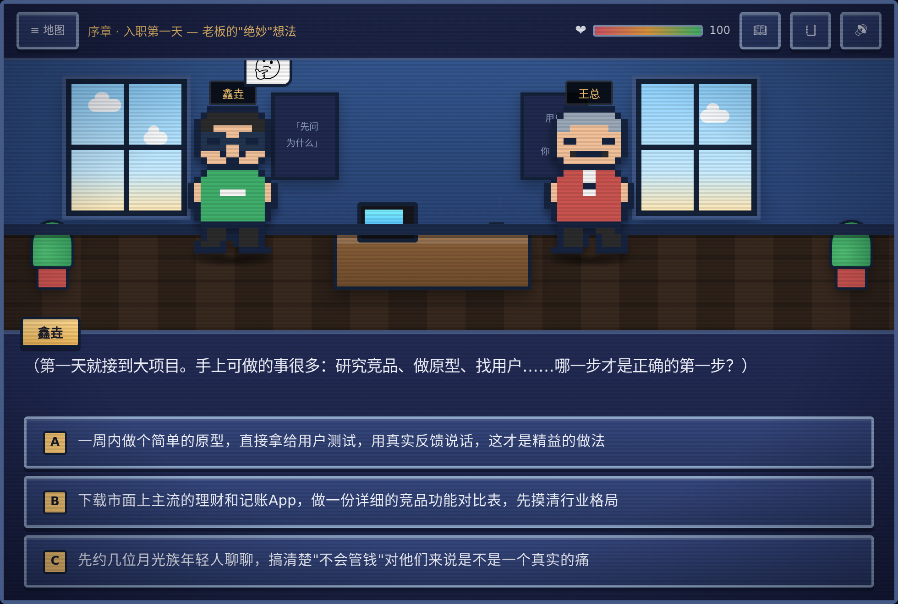
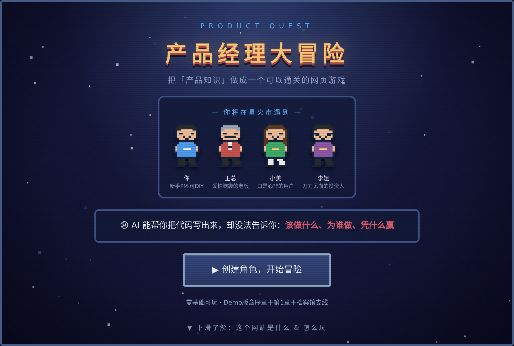
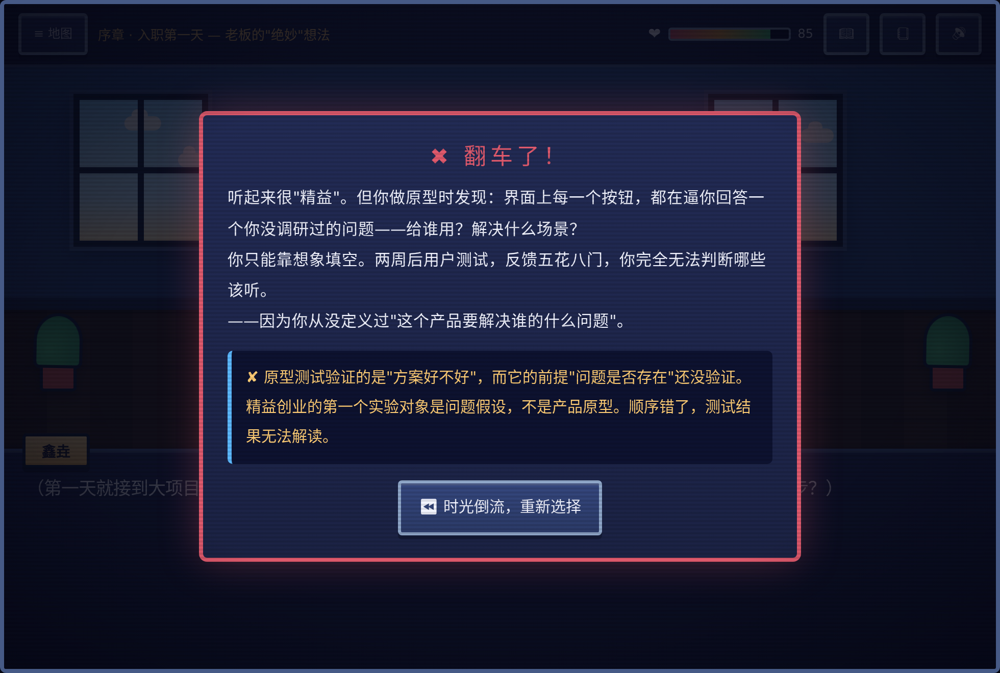
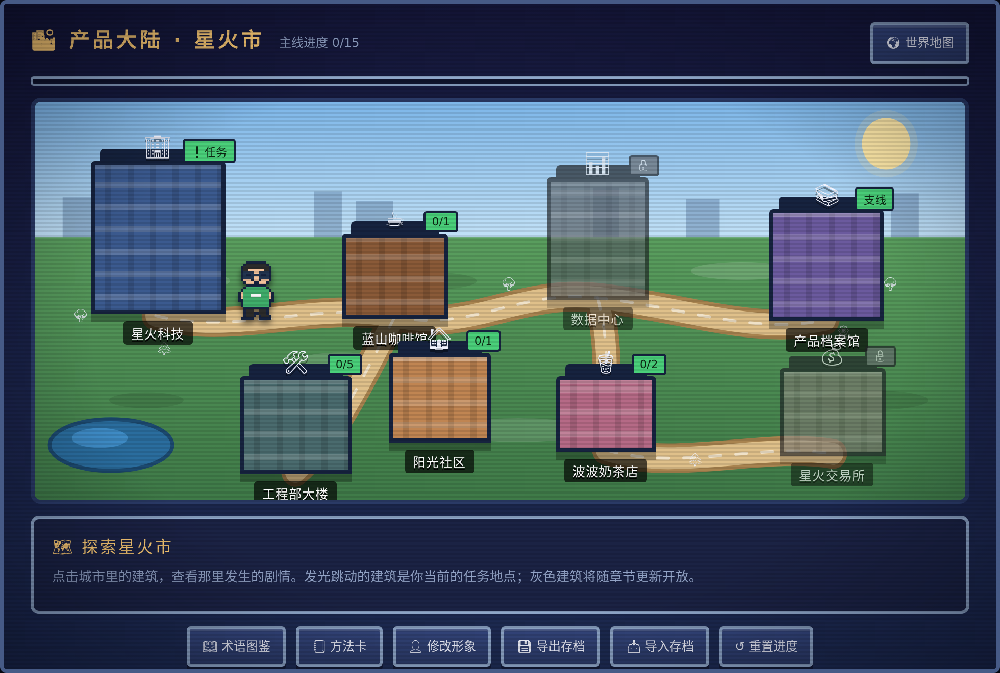
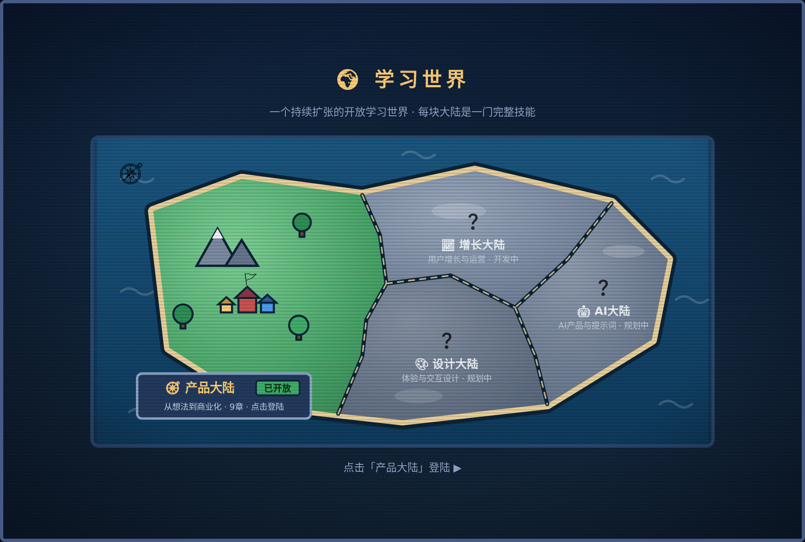
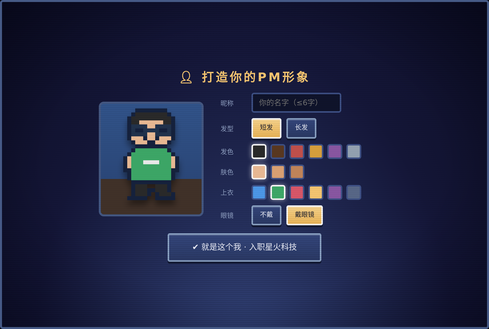
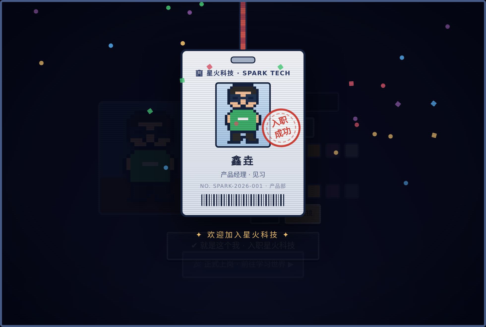

# 🎮 产品经理大冒险 · Product Quest

[](https://zread.ai/nuts-and-bytes/Product-quest)

> **把「产品知识」做成一个可以通关的网页游戏。**
> 你将扮演一名零基础的新手产品经理，入职创业公司「星火科技」，在爱拍脑袋的老板、毒舌的工程师、口是心非的用户之间做出一个个真实决策——通关，就是学完一遍从想法到商业化的完整 0→1。

**🕹️ 在线试玩：<https://nuts-and-bytes.github.io/Product-quest/>**（无需注册，打开即玩，进度自动保存）

**🖥️📱 多端支持，一个链接玩遍所有设备：**

| 设备 | 怎么玩 | 体验 |
|---|---|---|
| 💻 电脑浏览器 | 直接打开链接 | 完整桌面布局，键盘空格/回车可推进对话 |
| 📱 手机浏览器 | 同一链接，Safari/Chrome 均可 | 竖屏专属布局，触屏优化，城市地图滑动探索 |
| 💬 微信内 | 把链接发到聊天/群里，点开即玩 | 无需跳出微信，方便分享给学习搭子 |
| 📲 平板 | 横竖屏均可 | 自动匹配对应布局 |

进度保存在各设备本地；换设备时用游戏内「导出存档 → 导入存档」即可无缝迁移。

---

## 📷 游戏长什么样



| | |
|:---:|:---:|
|  痛点直击的着陆页 |  选错不批评，直接看后果 |
|  星火市：每栋建筑一段剧情 |  持续扩张的学习大陆 |
|  捏一个自己的像素形象 |  专属工牌，仪式感拉满 |

---

## 为什么做这个游戏？

- 你是文科/商科出身，对做产品心动，却被"技术门槛"三个字劝退
- 你收藏了几十篇产品干货，还是不知道第一步该干嘛
- PRD、MVP、AARRR……每个字都认识，连起来全懵
- **AI 时代，写代码越来越便宜——"判断该做什么"越来越值钱**

看书太枯燥，上课太贵，实习没门路？那就来玩一局。

## 🌟 它不是课程，是一场冒险

| 玩法 | 说明 |
|---|---|
| 🎭 **剧情闯关** | 每一关都是真实工作场景：老板深夜拍脑袋、投资人刀刀见血、用户嘴上说"会用呀"身体却很诚实 |
| ⚖️ **三级决策** | 选项没有一眼假：最优 ◎ / 次优 ◑（听着专业，藏着坑）/ 翻车 ✖（对应真实世界的失败案例） |
| 🔍 **数据法医** | 进阶章节里，选项不再是文字按钮——直接在仪表盘上点出北极星指标、在漏斗图上切开流失、在白板上划定付费墙 |
| 💥 **翻车剧场** | 选错不扣课时费，直接看后果：留存崩了、老板怒了、工程师把电脑合上了 |
| 📖 **术语图鉴** | MVP、JTBD、KANO、RICE……71 个术语在剧情中解锁收集，每条都标注权威出处 |
| 📒 **方法卡** | 通关掉落实战方法论：Mom Test 访谈手册、优先级三板斧、PRD 评审生存指南…… |
| 📚 **产品档案馆** | 微信红包、Duolingo、麦当劳奶昔、Instagram、拼多多百元券事故……真实案例拆解 |
| 📝 **随堂检验** | 每关 3 题通关必答，S/A/B/C 评级，可反复挑战刷成绩 |
| 👤 **角色 DIY** | 捏一个自己的像素形象，领取专属工牌，正式入职星火科技 |

全程像素 RPG 风格，人物、场景、音效全部由代码生成——本仓库没有一张美术素材图。

## 🗺️ 冒险进度

| 章节 | 主题 | 状态 |
|---|---|---|
| 序章 | 入职第一天：产品经理到底是干嘛的 | ✅ 可玩 |
| 第1章 | 想法值不值得做：第一性原理 · 市场测算 · Mom Test 访谈 | ✅ 可玩 |
| 第2章 | 用户与需求：种子用户 · JTBD · 旅程地图 · KANO/RICE | ✅ 可玩 |
| 第3章 | PRD与原型：用户故事 · 异常流 · 埋点 · 评审辩护 | ✅ 可玩 |
| 第4章 | 听懂工程师说话：技术地图 · 成本冰山 · 站会黑话 · AI能力边界 | ✅ 可玩 |
| 第5章 | 上线冲刺：测试验收 · 灰度发布 · 深夜P0危机 · 无责复盘 | ✅ 可玩 |
| 第6章 | 数据与增长：北极星 · AARRR漏斗 · 留存曲线 · A/B测试 · LTV/CAC | ✅ 可玩 |
| 第7章 | 怎么赚钱：变现模式 · 定价心理战 · 付费墙 · 单位经济 · 融资路演 | ✅ 可玩 |
| 终章 | 复盘与作品集：STAR 面试特训 · 金色工牌 · 一键生成作品集 | ✅ 可玩 |
| 更远处 | 增长大陆 · AI大陆 · 设计大陆——一个持续扩张的学习世界 | 🌍 敬请期待 |

> 🎉 **产品大陆主线已全部完结！** 约 **8 小时**剧情量：37 个关卡、80 个决策点、111 道检验题、71 个术语、37 张方法卡、16 篇案例拆解。通关后可一键生成**专属产品作品集**（独立 HTML，附诚实声明与面试叙事模板）。全站图标为手绘像素风，与画面风格统一。

## 📖 知识从哪来？

所有知识点均改写自公认的权威来源，游戏内每个术语、每张方法卡都逐条标注出处：

**产品经典**：Marty Cagan《Inspired（启示录）》（SVPG）· Eric Ries《精益创业》· Rob Fitzpatrick《The Mom Test》· Clayton Christensen《创新者的任务》（JTBD/奶昔研究）· Teresa Torres《Continuous Discovery Habits》· Melissa Perri《Escaping the Build Trap》· Geoffrey Moore《跨越鸿沟》· Alan Cooper《About Face》· Steve Mulder《赢在用户》（Persona）· Giles Colborne《简约至上》

**中文经典**：《俞军产品方法论》· 苏杰《人人都是产品经理》· 王坚《结网》· 张小龙微信公开课演讲（公开实录）

**方法与框架**：狩野纪昭 KANO 模型（1984）· Intercom RICE 打分法 · DSDM MoSCoW 法则 · BJ Fogg《Tiny Habits》行为模型 B=MAP（斯坦福行为设计实验室）· Sean Ellis《增长黑客》· Barbara Minto《金字塔原理》· Al Ries & Jack Trout《定位》· 贝索斯致股东信（双向门决策）· Mike Cohn《User Stories Applied》· BDD/Gherkin 验收标准 · Steve Krug《Don't Make Me Think》

**行业研究与案例**：Alexander Osterwalder《商业模式新生代》· Costco/Spotify 公开财报 · CB Insights 创业失败原因研究 · Nielsen Norman Group 可用性研究 · Lenny's Newsletter · Sarah Frier《No Filter》（Instagram 创业史）· 微信红包/拼多多百元券等公开报道与财报资料

发现引用错误或有更权威的来源？欢迎提 Issue 指正——**专业性是这个项目的生命线。**

## 🚀 本地运行 / 参与共建

```bash
git clone https://github.com/nuts-and-bytes/Product-quest.git
# 无需安装任何依赖，双击 index.html 即可游玩
```

项目采用**引擎与内容分离**架构：`engine.js` 是游戏引擎（不含剧情），`content/` 下每个文件就是一章内容——想新增章节或修正知识点，改 JSON 式的内容文件即可，无需碰引擎。详见 `content/pm/ch0-prologue.js` 文件头的结构说明。

发现 bug、知识点错误，或想要某个新章节？欢迎提 [Issue](../../issues)。

每一版改了什么、为什么这么改，见 [CHANGELOG.md](CHANGELOG.md)。

## 📜 许可

代码 MIT 许可；剧情与知识内容采用 CC BY-NC 4.0（署名-非商业性使用）。

---

**⭐ 如果这个项目帮到了你，点个 Star 让更多想入行的人看到它。**
*每个决策，都会改变他们对你的态度——在游戏里，也在真实的职场里。*
